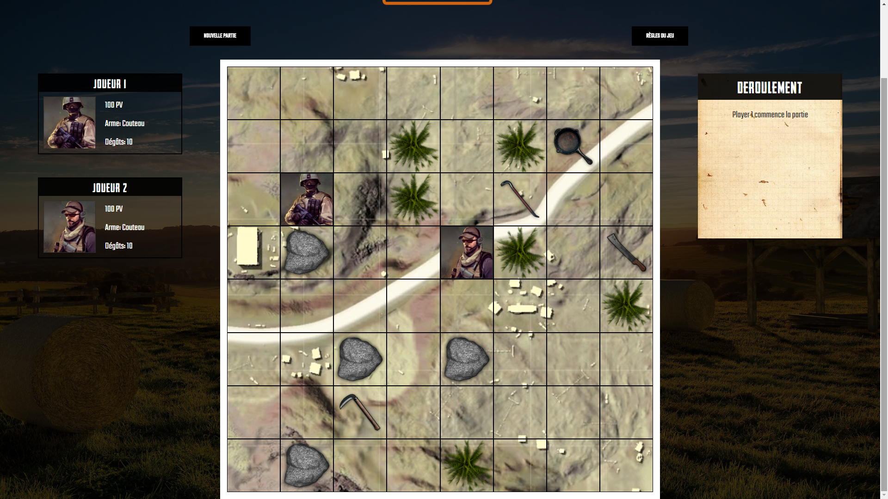

# Turn based board game

6th OpenClassroom project, the point is to practice POO and jQuery by creating a turn-based game with 2 players.

# Directives
- Generate a random board display (random position of elements)
- Player can move up to three cells MAX if it's not a blocked path 
- A player must pick up a weapon if he walks on it (differents weapons spawns)
- Player can attack other player if he is next to him:
	* Deathmatch on, fight continue until one player's PV drop to 0
	* A player can choose to "defend" next turn and take half of the damages

- If a player die, a victory message with the name of the winner appears

# Run app
Open `index.html`
